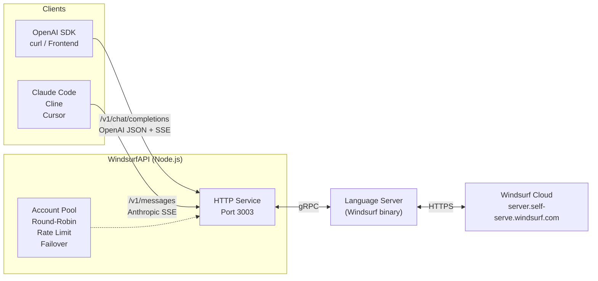
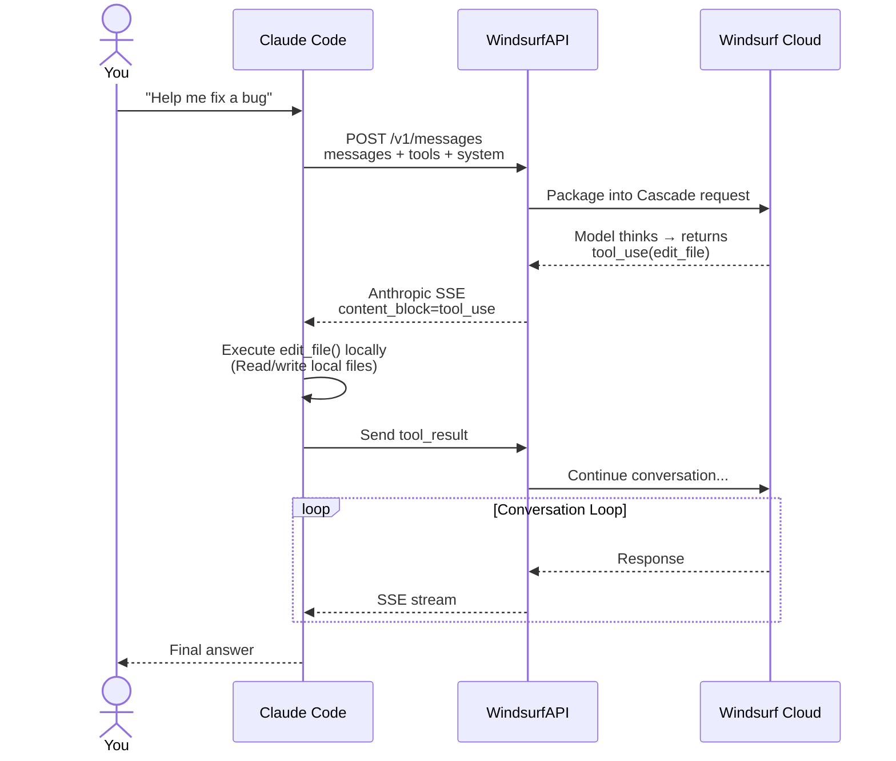

# Star & Follow me and I'll leave you alone

<p align="center">
  <a href="https://github.com/dwgx/WindsurfAPI/stargazers"></a>&nbsp;
  <a href="https://github.com/dwgx"></a>
  &nbsp;·&nbsp;
  <a href="README.md">中文/简体中文</a>
</p>

# Notice

> **If you haven't starred and followed**: commercial use, resale, paid deployment, hosting as a backend for public services, or reselling as a relay service is strictly prohibited.
> **If you have starred and followed**: go ahead, I'll look the other way.
>
> The code itself is MIT-licensed (see [LICENSE](LICENSE)); the above is the author's personal stance.

---

Turns [Windsurf](https://windsurf.com) (formerly Codeium)'s AI models into **two standard, compatible APIs**:

- `POST /v1/chat/completions` — **OpenAI Compatible** for any OpenAI SDK.
- `POST /v1/messages` — **Anthropic Compatible** for direct connection with Claude Code / Cline / Cursor.

**100+ Models**: Claude 4.5/4.6/Opus 4.7 · GPT-5/5.1/5.2/5.4 series · Gemini 2.5/3.0/3.1 · Grok · Qwen · Kimi K2.x · GLM 4.7/5/5.1 · MiniMax · SWE 1.5/1.6 · Arena, etc. Zero npm dependencies, pure Node.js.

## What is it doing?



**What it does**:
1. An HTTP service (port 3003) exposing both OpenAI and Anthropic APIs simultaneously.
2. Translates requests into Windsurf's internal gRPC protocol and sends them to the Windsurf cloud via a local Language Server.
3. Manages an account pool with automatic round-robin, rate limiting, and failover.
4. Strips the upstream Windsurf identity before returning, making the model identify as "I am Claude Opus 4.6, developed by Anthropic."

## How to use with Claude Code / Cline / Cursor

The model itself does **not** operate on files — file operations are executed locally by the IDE Agent client (Claude Code, Cline, etc.):



**Key Point**: WindsurfAPI is only responsible for **passing** `tool_use` / `tool_result`. The client CLI is what actually modifies the files.

## Quick Start

### One-Click Deployment

```bash
git clone https://github.com/dwgx/WindsurfAPI.git
cd WindsurfAPI
bash setup.sh          # Create directories · Set permissions · Generate .env
node src/index.js
```

Dashboard: `http://YOUR_IP:3003/dashboard`

### Docker Deployment

```bash
cp .env.example .env

# Optional: place language_server_linux_x64 under .docker-data/opt/windsurf/
# If omitted, the container will auto-download it into /opt/windsurf/ on first boot.

docker compose up -d --build
docker compose logs -f
```

Default mounts:

- `./.docker-data/data`: persisted `accounts.json`, `proxy.json`, `stats.json`, `runtime-config.json`, `model-access.json`, and `logs/`
- `./.docker-data/opt/windsurf`: Language Server binary and its data directory
- `./.docker-data/tmp/windsurf-workspace`: temporary workspace

If you want a different persistence location, set `DATA_DIR` in `.env`. The Docker setup defaults it to `/data`.

### One-Click Update

To pull the latest fixes after deployment, just run one command:

```bash
cd ~/WindsurfAPI && bash update.sh
```

`update.sh` does: `git pull` → stops PM2 → kills any residual process on port 3003 → restarts → health check.

If you are using our public instances (`skiapi.dev`, etc.), you don't need to do anything; we've already pushed the updates.

### Manual Installation

```bash
git clone https://github.com/dwgx/WindsurfAPI.git
cd WindsurfAPI

# Language Server binary — one-click download + chmod (from Exafunction/codeium releases)
mkdir -p /opt/windsurf/data/db
bash install-ls.sh

# Or use a local binary you already have:
#   bash install-ls.sh /path/to/language_server_linux_x64
# Or specify a custom URL:
#   bash install-ls.sh --url https://example.com/language_server_linux_x64

# ⚠️ Can't see opus-4.7 / other new models?
# The public Exafunction/codeium release is stuck at v2.12.5 (Jan 2026)
# and does not ship 4.7. To get 4.7, copy the LS binary out of the
# Windsurf desktop app bundle:
#
#   macOS:   "$HOME/Library/Application Support/Windsurf/resources/app/extensions/windsurf/bin/language_server_macos_arm"
#   Linux:   "$HOME/.windsurf/bin/language_server_linux_x64"
#            or /opt/Windsurf/resources/app/extensions/windsurf/bin/language_server_linux_x64
#   Windows: %APPDATA%\Windsurf\bin\language_server_windows_x64.exe
#
#   # Install from the local desktop copy:
#   bash install-ls.sh /path/to/language_server_linux_x64
#
# Once swapped, /v1/models will auto-discover the newer catalog from the cloud.

cat > .env << 'EOF'
PORT=3003
API_KEY=
DEFAULT_MODEL=claude-4.5-sonnet-thinking
MAX_TOKENS=8192
LOG_LEVEL=info
LS_BINARY_PATH=/opt/windsurf/language_server_linux_x64
LS_DATA_DIR=/opt/windsurf/data
LS_PORT=42100
DASHBOARD_PASSWORD=
EOF

# For local macOS deployments, use the LS_BINARY_PATH printed by
# install-ls.sh and set LS_DATA_DIR to a user-writable directory,
# for example /Users/you/.windsurf/data.

# Note: Inline comments are supported in .env for unquoted values:
#   PORT=3003  # Service port
# Quoted values preserve everything inside the quotes.

node src/index.js
```

## Add Accounts

After the service is running, you need to add Windsurf accounts. There are three ways:

**Method 1: Dashboard One-Click Login (Recommended)**

Open `http://YOUR_IP:3003/dashboard` → Login to get token → Click **Sign in with Google** or **Sign in with GitHub** (OAuth popup) or fill in email/password directly. All methods will automatically add the account to the pool.

**Method 2: Token (Works with any login method)**

Go to [windsurf.com/show-auth-token](https://windsurf.com/show-auth-token) to copy your token:

```bash
curl -X POST http://localhost:3003/auth/login
  -H "Content-Type: application/json"
  -d '{"token": "YOUR_TOKEN"}'
```

**Method 3: Batch**

```bash
curl -X POST http://localhost:3003/auth/login
  -H "Content-Type: application/json"
  -d '{"accounts": [{"token": "t1"}, {"token": "t2"}]}'
```

## Usage Examples

### OpenAI Format (Python / JS / curl)

```python
from openai import OpenAI
client = OpenAI(base_url="http://YOUR_IP:3003/v1", api_key="YOUR_API_KEY")
r = client.chat.completions.create(
    model="claude-sonnet-4.6",
    messages=[{"role": "user", "content": "Hello"}]
)
print(r.choices[0].message.content)
```

### Anthropic Format (Directly with Claude Code)

```bash
export ANTHROPIC_BASE_URL=http://YOUR_IP:3003
export ANTHROPIC_API_KEY=YOUR_API_KEY
claude                # Use Claude Code as usual
```

```bash
# Raw curl test
curl http://localhost:3003/v1/messages
  -H "Authorization: Bearer YOUR_KEY"
  -H "anthropic-version: 2023-06-01"
  -d '{"model":"claude-opus-4.6","max_tokens":100,"messages":[{"role":"user","content":"Hello"}]}'
```

### Cline / Cursor / Aider

In your client's settings for **Custom OpenAI Compatible**:
- Base URL: `http://YOUR_IP:3003/v1`
- API Key: YOUR_API_KEY
- Model: Choose any supported model.

> **Cursor users**: Cursor's client-side whitelist blocks model names containing `claude` (the request never reaches the backend). Use these aliases instead:
>
> | Type in Cursor | Actual model |
> |---|---|
> | `opus-4.6` | claude-opus-4.6 |
> | `sonnet-4.6` | claude-sonnet-4.6 |
> | `opus-4.7` | claude-opus-4-7-medium |
> | `ws-opus` | claude-opus-4.6 |
> | `ws-sonnet` | claude-sonnet-4.6 |
>
> GPT / Gemini / DeepSeek models are not affected by Cursor's filter — use their original names.

## Environment Variables

| Variable | Default | Description |
|---|---|---|
| `PORT` | `3003` | Service port |
| `API_KEY` | empty | API key required for requests. Leave empty to disable validation. |
| `DATA_DIR` | project root | Directory for persisted JSON state and `logs/`. Docker deployments should usually use `/data`. |
| `CODEIUM_API_KEY` | empty | Direct API key from Windsurf (alternative to token-based auth). |
| `CODEIUM_AUTH_TOKEN` | empty | Token from [windsurf.com/show-auth-token](https://windsurf.com/show-auth-token). |
| `CODEIUM_EMAIL` | empty | Email for Windsurf account authentication. |
| `CODEIUM_PASSWORD` | empty | Password for Windsurf account authentication. |
| `CODEIUM_API_URL` | `https://server.self-serve.windsurf.com` | Windsurf cloud API endpoint. |
| `DEFAULT_MODEL` | `claude-4.5-sonnet-thinking` | The model to use if `model` is not specified. |
| `MAX_TOKENS` | `8192` | Default maximum number of response tokens. |
| `LOG_LEVEL` | `info` | debug / info / warn / error |
| `LS_BINARY_PATH` | Linux: `/opt/windsurf/language_server_linux_x64`; Linux arm64: `/opt/windsurf/language_server_linux_arm`; macOS: `~/.windsurf/language_server_macos_*` | Path to the LS binary. |
| `LS_PORT` | `42100` | LS gRPC port. |
| `LS_DATA_DIR` | Linux: `/opt/windsurf/data`; macOS: `~/.windsurf/data` | Per-proxy LS data directory root. |
| `DASHBOARD_PASSWORD` | empty | Dashboard password. Leave empty for no password. |
| `ALLOW_PRIVATE_PROXY_HOSTS` | empty | Set to `1` to allow private/internal IPs (e.g., `192.168.x.x`, `10.x.x.x`) in proxy tests and login. Leave empty to only allow public addresses (default). |
| `CASCADE_REUSE_STRICT` | `0` | Set to `1` for strict conversation reuse mode (waits for same fingerprint). |
| `CASCADE_REUSE_STRICT_RETRY_MS` | `60000` | Retry delay in ms for strict reuse mode. |
| `CASCADE_REUSE_HASH_SYSTEM` | `0` | Set to `1` to include system messages in conversation reuse hash. |
| `ANTHROPIC_STREAM_PROVISIONAL_TEXT` | `1` | Claude Code/sub2api tuning: stream provisional text even if the same Anthropic turn later ends with `tool_use`. |
| `STICKY_SESSION_ENABLED` | `0` | Optional same caller/model account affinity. Default off; the cascade continuation pool remains the primary fix. |
| `STICKY_SESSION_TTL_MS` | `1800000` | Sticky binding TTL in ms. |
| `STICKY_SESSION_MAX` | `10000` | Maximum sticky bindings. |

## Dashboard Features

Open `http://YOUR_IP:3003/dashboard`:

| Panel | Features |
|---|---|
| **Overview** | Runtime status · Account pool · LS health · Success rate |
| **Login/Get Token** | Google / GitHub OAuth one-click login · Email/password login · **Test Proxy** button (tests egress IP) |
| **Account Management** | Add / Delete / Disable · Detect subscription level · Check balance · Ban models via blacklist |
| **Model Control** | Global model whitelist/blacklist |
| **Proxy Config** | Global or per-account HTTP / SOCKS5 proxy |
| **Logs** | Real-time SSE streaming · Filter by level · `turns=N chars=M` diagnostics per turn |
| **Stats & Analytics** | Time range 6h / 24h / 72h · Per-account dimensions · p50 / p95 latency |
| **Experimental** | Cascade conversation reuse · **Model Identity Injection (custom prompt per vendor)** |

## Supported Models

100+ static models in the main catalog plus dynamic cloud-side models added at startup via `mergeCloudModels`. Full list: `GET /v1/models`, or browse the [GitHub Pages model catalog](https://dwgx.github.io/WindsurfAPI/#models) (auto-generated from `src/models.js`).

<details>
<summary><b>Claude (Anthropic)</b> — 21 models</summary>

claude-3.5-sonnet / 3.7-sonnet / thinking · claude-4-sonnet / opus / thinking · claude-4.1-opus · claude-4.5-haiku / sonnet / opus · claude-sonnet-4.6 (incl. 1m / thinking / thinking-1m) · claude-opus-4.6 / thinking · **claude-opus-4.7-medium**

</details>

<details>
<summary><b>GPT (OpenAI)</b> — 55 models</summary>

gpt-4o · gpt-4.1 · gpt-5 series (incl. medium / high / codex) · **gpt-5.1 series** (base / low / medium / high + fast + codex, all 6 variants) · **gpt-5.2 series** (none / low / medium / high / xhigh + fast + codex) · **gpt-5.4 series** (base / mini × low/medium/high/xhigh) · o3 series (base / mini / pro) · o4-mini

</details>

<details>
<summary><b>Gemini (Google)</b> — 9 models</summary>

gemini-2.5-pro / flash · gemini-3.0-pro / flash (minimal / low / medium / high — 4 reasoning levels) · gemini-3.1-pro (low / high)

</details>

<details>
<summary><b>Open source / Chinese providers</b></summary>

**Kimi**: kimi-k2 / k2.5 / k2-6 · **GLM**: glm-4.7 / 5 / 5.1 · **Qwen**: qwen-3 · **Grok**: grok-3 / grok-3-mini-thinking / grok-code-fast-1 · **MiniMax**: minimax-m2.5

</details>

<details>
<summary><b>Windsurf in-house + Arena</b></summary>

swe-1.5 / 1.5-fast / 1.6 / 1.6-fast · arena-fast · arena-smart

</details>

> **Free-account entitlements** typically include `gemini-2.5-flash`, `glm-4.7` / `glm-5` / `5.1`, `kimi-k2` / `k2.5` / `k2-6`, `qwen-3` and similar open-source models; Claude family, GPT family, and Opus / thinking variants require Pro. Each account's exact list shows up in the dashboard.
>
> **Tool-calling reliability (measured v2.0.82+):** Claude family is the most reliable (their training covered prompt-level tool protocols); GLM-4.7 / Kimi-K2.5 work for most cases via NLU fallback + optional retry-with-correction; GLM-5.1 is unreliable on the cascade backend (it often returns empty responses, no narration to recover from); GPT family is also limited because the cascade upstream doesn't carry `tools[]` schema. For Claude Code / Cline / Codex doing local tool calls, prefer `claude-haiku-4.5` or `claude-sonnet-4.6`.

### Language-Following for CJK Users

The service automatically detects Chinese, Japanese, or Korean characters in your messages and injects a language-following hint to ensure the model responds in the same language. This fixes the issue where Claude Code's large English system prompt would override the communication language.

## Architecture Highlights

- **Zero npm dependencies** Everything uses `node:*` built-ins · Protobuf is handcrafted (`src/proto.js`) · Download and run.
- **Account Pool + LS Pool** Each independent proxy gets its own LS instance, no mixing.
- **NO_TOOL Mode** `planner_mode=3` disables Cascade's built-in tool loop to prevent `/tmp/windsurf-workspace/` path leakage.
- **Three-layer sanitization** LS built-in tool result filtering · `<tool_call>` text parsing · Output path cleaning.
- **Real token counting** Fetches real `inputTokens` / `outputTokens` / `cacheRead` / `cacheWrite` from `CortexStepMetadata.model_usage`. `prompt_tokens` includes cacheWrite.

## PM2 Deployment

```bash
npm install -g pm2
pm2 start src/index.js --name windsurf-api
pm2 save && pm2 startup
```

**Do not** use `pm2 restart` (it can create zombie processes). Use the one-click update script `bash update.sh`.

## Firewall

```bash
# Ubuntu
ufw allow 3003/tcp

# CentOS
firewall-cmd --add-port=3003/tcp --permanent && firewall-cmd --reload
```

Remember to open port 3003 in your cloud provider's security group.

## FAQ

**Q: Login fails with "Invalid email or password"**
A: You probably signed up for Windsurf using Google/GitHub, which means your account doesn't have a password. The Dashboard's login panel now directly supports one-click login via Google / GitHub OAuth.

**Q: The model says "I cannot operate on the file system"**
A: This is a **chat API**, not an IDE agent. To have the model actually modify files, use a client CLI like **Claude Code / Cline / Cursor / Aider** and point their API base URL to this service. The model will produce `tool_use`, the client executes it locally, and sends the `tool_result` back. The diagram above shows the detailed flow.

**Q: Context is lost / The model forgets previous parts of the conversation**
A: Multi-account round-robin will **not** lose context — every request repackages the full history and sends it to Cascade. The real reason is usually a relay layer (like new-api) not passing the full `messages[]` array. Check `turns=N` in the Dashboard logs: if it's a multi-turn conversation but `turns=1`, then a layer before you has already dropped the history.

**Q: Long prompts are timing out**
A: This has been fixed. Cold stall detection is now adaptive to input length, with a max timeout of 90s for long inputs.

**Q: Can I use Claude Code?**
A: Yes. `export ANTHROPIC_BASE_URL=http://YOUR_API` + `export ANTHROPIC_API_KEY=YOUR_KEY`. `/v1/messages` supports the full suite: system, tools, tool_use, tool_result, stream, and multi-turn, all tested and working.

**Q: What models can free accounts use?**
A: Mostly `gemini-2.5-flash`, `glm-4.7` / `5` / `5.1`, `kimi-k2` / `k2.5` / `k2-6`, `qwen-3` (open-source series). Claude family, GPT family, and Opus / Max / -thinking variants need Pro entitlement. The dashboard shows each account's entitled list, and `model_not_entitled` error responses include an `available_in_pool` field with the names you can switch to.

**Q: Are tool calls reliable on free accounts?**
A: Depends on the model. Claude family is rock-solid (also free-account-entitled when available). GLM-4.7 / Kimi-K2.5 work in most cases via NLU recovery + `WINDSURFAPI_NLU_RETRY=1` retry-with-correction. GLM-5.1 is unreliable on the cascade backend (frequent empty responses) — proxy can't fix this. GPT family is similarly limited by the cascade protocol layer not passing `tools[]` schema. **For Claude Code / Cline / Codex doing local file/shell ops prefer `claude-haiku-4.5` or `claude-sonnet-4.6`.**

**Q: 31 trial accounts go unavailable after a few hundred calls**
A: Likely the model is a weekly-quota variant — `claude-opus-4-7-max` / `gpt-5.5-xhigh` / `claude-sonnet-4-7-thinking` etc. cap at 5 calls per week per account, so 31 accounts × 5 ≈ 150 calls hit the wall fast. Switch to `claude-sonnet-4.6` / `claude-haiku-4.5` (daily quotas are much wider). Verify with `docker logs windsurfapi-windsurf-api-1 | grep rate_limit` — the per-account cooldown reason is in the log.

## Contributors

Huge thanks to the following folks who sent pull requests or systematically audited the code:

- [@dd373156](https://github.com/dd373156) — [PR #1](https://github.com/dwgx/WindsurfAPI/pull/1)
  Fixed the Pro tier model-merge logic: the hardcoded table wasn't picking up dynamically-fetched cloud models, so Pro accounts couldn't see newly-released models in Cursor / Cherry Studio.
- [@colin1112a](https://github.com/colin1112a) — [PR #13](https://github.com/dwgx/WindsurfAPI/pull/13)
  A single-shot audit that flagged 15 security / concurrency / resource bugs: XSS escaping, shell injection, OOM guards, auth route placement, gRPC double-callback, LS pool race, HTTP/2 frame size caps, and more. On top of this we later added a JS-level `escJsAttr`, coalesced concurrent `ensureLs` calls via `_pending`, released pooled sessions on LS exit, and fixed 6 more issues surfaced by a follow-up Antigravity audit.
- [@baily-zhang](https://github.com/baily-zhang) — [PR #36](https://github.com/dwgx/WindsurfAPI/pull/36) + [PR #45](https://github.com/dwgx/WindsurfAPI/pull/45)
  Core Cascade reuse fixes: stableTurns fingerprinting (#36) solved 0% hit rate; trajectory offset tracking (#45) eliminated context bloat during multi-turn reuse.
- [@aict666](https://github.com/aict666) — [PR #44](https://github.com/dwgx/WindsurfAPI/pull/44)
  Fixed inferTier demoting Pro/Trial accounts to free after every chat call, preserving the authoritative tier from GetUserStatus.
- [@smeinecke](https://github.com/smeinecke) — [PR #43](https://github.com/dwgx/WindsurfAPI/pull/43)
  Full Dashboard i18n: 14 commits covering Chinese/English translations, I18n system, and check-i18n.js validation tool.

Want to be on this list? Open an [issue](https://github.com/dwgx/WindsurfAPI/issues) or a [pull request](https://github.com/dwgx/WindsurfAPI/pulls). The dashboard has a Credits panel on the left that shows the same info.

## License

MIT
